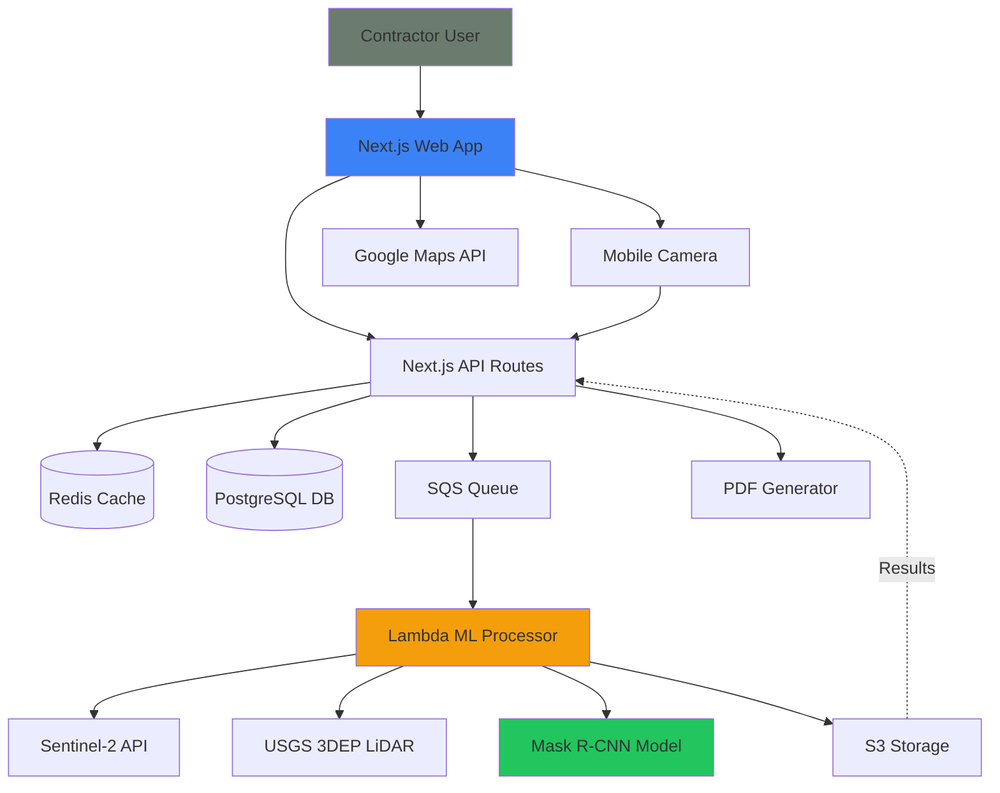

# High-Level Architecture

## Technical Summary

The system follows a **hybrid serverless architecture** combining:
- **Next.js full-stack framework** for web app and API layer
- **Serverless ML processing** on AWS Lambda for compute-intensive tasks
- **Event-driven architecture** for asynchronous ML pipeline execution
- **Progressive web app** patterns for mobile-first experience

This architecture achieves the PRD's goals of <5 minute results and ±3% accuracy by:
1. Leveraging free public datasets (Sentinel-2 satellite, USGS LiDAR)
2. Pre-trained Mask R-CNN models for roof detection (~90% accuracy)
3. Parallel processing of satellite imagery and LiDAR point clouds
4. Mobile camera capture fallback for obstructed properties

## System Overview

## Architectural Patterns

**1. API Gateway Pattern**
- Next.js API Routes act as gateway to ML services
- Request validation, authentication, rate limiting at edge
- Async job submission for long-running ML tasks

**2. Queue-Based Processing**
- SQS for decoupling web tier from ML processing
- Enables horizontal scaling of ML workers
- Provides retry logic and dead letter queues

**3. CQRS (Command Query Responsibility Segregation)**
- Write path: User submits address → Queue → ML processing → Write results
- Read path: User polls for results → Cache-first → Database fallback
- Optimizes for fast reads on results page

**4. Repository Pattern**
- Data access layer abstracts database operations
- Shared TypeScript interfaces between frontend/backend
- Enables testing with mock repositories

**5. Fallback Pattern**
- Primary: Satellite + LiDAR analysis
- Secondary: Mobile-assisted capture for obstructions
- Tertiary: Partial results with confidence indicators

---
