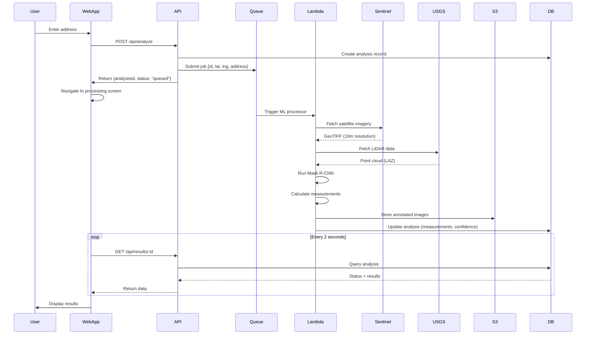
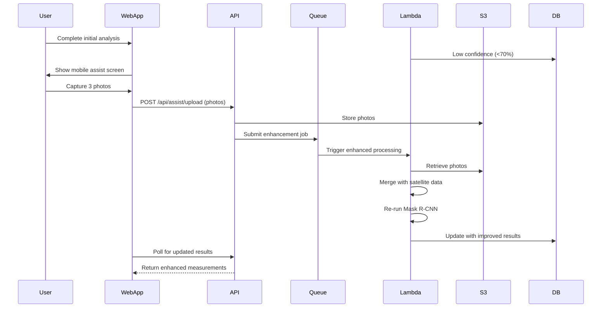

# System Architecture

## Repository Structure

**Monorepo** using Next.js convention:

```
companycam-roof-measurement/
├── .github/
│   └── workflows/
│       ├── ci.yml                  # CI pipeline
│       └── deploy.yml              # Deployment
├── app/                            # Next.js App Router
│   ├── page.tsx                    # Screen 1: Address Input
│   ├── analyze/
│   │   └── page.tsx                # Screen 2: Processing
│   ├── results/
│   │   └── page.tsx                # Screen 3a: Results
│   ├── assist/
│   │   └── page.tsx                # Screen 3b: Mobile Assist
│   ├── api/                        # API Routes
│   │   ├── analyze/
│   │   │   └── route.ts            # POST /api/analyze
│   │   ├── results/
│   │   │   └── [id]/
│   │   │       └── route.ts        # GET /api/results/:id
│   │   └── assist/
│   │       └── upload/
│   │           └── route.ts        # POST /api/assist/upload
│   ├── layout.tsx                  # Root layout
│   └── globals.css                 # Global styles
├── components/                     # React components
│   ├── ui/                         # shadcn/ui components
│   │   ├── button.tsx
│   │   ├── input.tsx
│   │   ├── card.tsx
│   │   └── ...
│   ├── address-input.tsx
│   ├── place-autocomplete.tsx
│   ├── camera-modal.tsx
│   ├── photo-guide-card.tsx
│   └── measurement-card.tsx
├── lib/                            # Shared utilities
│   ├── db/                         # Database layer
│   │   ├── client.ts               # Prisma client
│   │   └── repositories/           # Repository pattern
│   │       ├── analysis-repo.ts
│   │       └── photo-repo.ts
│   ├── cache/                      # Redis cache
│   │   └── client.ts
│   ├── queue/                      # SQS queue
│   │   └── client.ts
│   ├── pdf-generator.ts            # PDF export
│   ├── image-utils.ts              # Image compression
│   └── utils.ts                    # General utils
├── types/                          # TypeScript types
│   ├── index.ts                    # Shared types
│   └── api.ts                      # API types
├── ml-service/                     # Python ML service
│   ├── Dockerfile                  # Lambda container
│   ├── requirements.txt            # Python dependencies
│   ├── handler.py                  # Lambda entrypoint
│   ├── models/
│   │   ├── roof_detector.py        # Mask R-CNN wrapper
│   │   └── lidar_processor.py      # LiDAR analysis
│   ├── services/
│   │   ├── sentinel_client.py      # Sentinel-2 API
│   │   ├── usgs_client.py          # USGS 3DEP API
│   │   └── measurement_service.py  # Core logic
│   └── tests/
│       └── test_*.py
├── prisma/                         # Database
│   ├── schema.prisma               # Prisma schema
│   └── migrations/                 # DB migrations
├── public/                         # Static assets
│   └── logo.svg
├── infrastructure/                 # IaC (optional)
│   └── terraform/                  # AWS resources
│       ├── lambda.tf
│       ├── sqs.tf
│       └── s3.tf
├── docs/                           # Documentation
│   ├── prd.md
│   ├── front-end-spec.md
│   └── architecture.md
├── .env.example                    # Environment template
├── .env.local                      # Local environment
├── next.config.js                  # Next.js config
├── tailwind.config.ts              # Tailwind config
├── tsconfig.json                   # TypeScript config
├── package.json                    # Dependencies
└── README.md

```

## Data Flow

### Primary Flow (Success Path)



### Fallback Flow (Mobile Assist Path)



---
